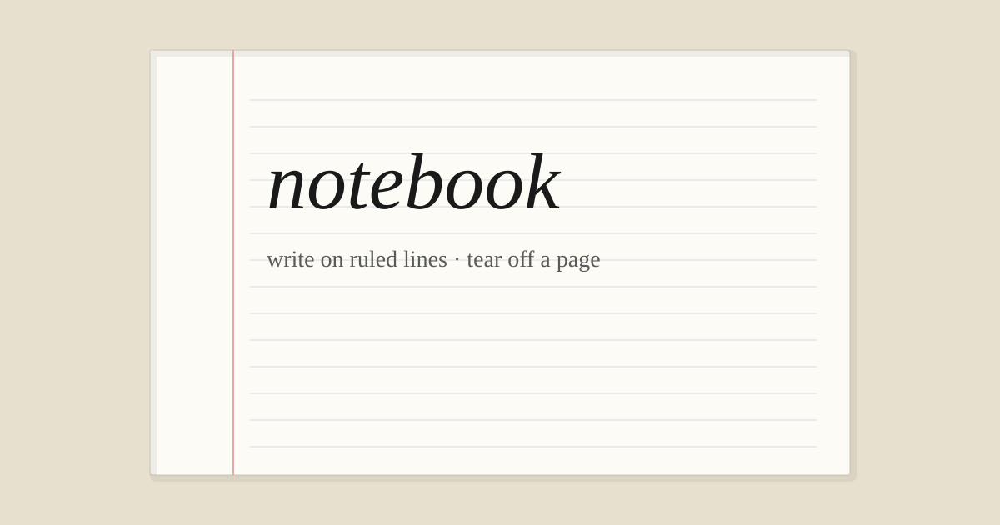

<p align="center">
  
</p>

# notebook

Write on ruled paper. Tear the page off. Share the link.

No accounts. No dashboard. No blue “publish” button that looks like every other site. Just cream paper, a red margin, and handwriting.

<p align="center">
  
</p>

Inspired by [telegra.ph](https://telegra.ph): open a blank page, write something, get a URL. We kept that spirit and put it on paper — the kind you’d actually want to write in.

## what it feels like

- Ruled lines that *stay* under your words (line-height locked to 32px)
- Caveat handwriting, ink-black text, warm desk background
- “Tear off this page” instead of Publish
- Errors that sound like a notebook: *this page seems to have been torn out*
- Link prompts and mistakes open a small paper slip — not a browser dialog

## write

1. Go to `/new`
2. Type. Use the stamped toolbar, or the keys you already know:
   - **Ctrl/⌘ Z** undo · **Ctrl/⌘ Y** or **⇧ Z** redo  
   - **Ctrl/⌘ B** bold · **I** italic · **U** underline · **E** code · **K** link
3. Hit **Tear off this page**
4. Share `/p/<slug>` — that’s the only URL that matters

Anyone with the link can read it. Nobody needs to sign up.

## run it

Telegram is the database (via [gramobase](https://www.npmjs.com/package/gramobase)). You need a bot + a channel once.

```bash
# sidecar — talks to Telegram
cd sidecar
npm install
npx gramobase init   # writes sidecar/.env
npm start            # :4000

# backend — serves the paper
cd ../go-backend
go run .             # :8080
```

Open [http://localhost:8080](http://localhost:8080).

Or: `docker compose up --build` (still needs `sidecar/.env` from init).

## how it’s built

```
you → Go (:8080) → Node sidecar (:4000) → gramobase → Telegram
```

Pages are a Telegraph-style node tree (`{ tag, attrs, children }`), not Markdown blobs. The editor is TipTap in plain JS. CSS is hand-written — no Tailwind, no framework chrome.

```
go-backend/   routes, validation, paper 404/500
sidecar/      thin HTTP wrapper around gramobase
static/       the paper (HTML, CSS, editor, favicon, og)
```

## license

MIT — tear it apart, rewrite the margins, keep the paper.
